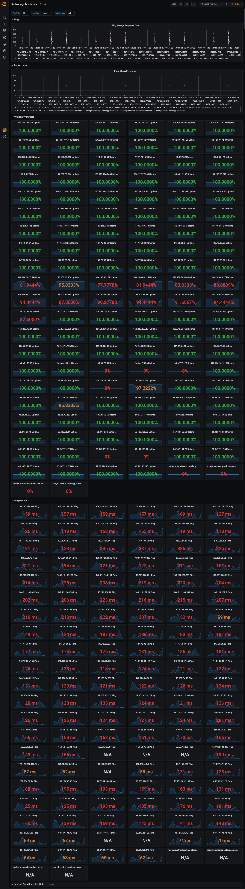

# POC Node.js Machines Ping Dashboard

A simple way to visualize the [Node.js Machines inventory](https://github.com/nodejs/build/blob/main/ansible/inventory.yml) and perform a cyclical ping to collect network metrics with a full dockerize environment and a fancy dashboard. 

## Requirements
- Docker and Docker-compose
- Node.js

## Features
- Download and digest the last inventory available in nodejs/build repository
- Simple NPM commands to manage the docker-compose infra
- Fancy dashboard
- Metrics are generated with Telegraf
- Metrics are stored in Influxdb
- Filter out non public Ips from the Node.js inventory

## Preview

## Setup

1. Get the last inventory version by running `npm run start`. This will generate the file `./telegraf.conf` with all the IPs and domains.
2. Start the Docker infra by running `npm run infra:start`. This can take some minutes depending on your network
3. Go to http://localhost:3000/login
    - Login it with user `admin` and pass `admin`
4. Add new data source in http://localhost:3000/datasources/new as follows:
    - Select `InfluxDb`
    - HTTP url: `http://influxdb:8086`
    - InfluxDB Details Database: `telegraf`
    - InfluxDB Details User: `root`
    - Click in `Save & Test`
5. Import a fancy dashboard in http://localhost:3000/dashboard/import
    - Add id `2690` and press `Load`
    - (In the next page) Select `InfluxDB` and press `Import`

### Stop

Just run `npm run infra:stop`

### Refresh the hosts list

1. Stop the infra `npm run infra:stop`
2. Update the hosts lists `npm run start`
3. Start the infra `npm run infra:start`

### Change Telegraf settings

Make any change in `src/telegraf.conf` and this file is extended with the hosts ips

## Acknowledgment

- [Monitorizar con Grafana + InfluxDB + Telegraf, usando docker compose | José Maria Labarta](https://www.youtube.com/watch?v=ykyb8K1dYuY)
- [Internet Uptime Monitor | Grafana Dashboard](https://grafana.com/grafana/dashboards/2690-internet-uptime-monitor/)
